  

<h2 align="center">👋 Welcome to my development space!</h2>

  <strong>Fullstack Developer &amp; AI Integration Specialist</strong>

I am a Fullstack Developer with <strong>3 years of practical experience</strong> in website development, business process automation, and Artificial Intelligence (AI/ML) integration. I possess a strong background in optimizing system performance, combining modern UI/UX design thinking and in-depth AI application skills ("AI vibe coding") to engineer smart, precise, and high-value software solutions for businesses.

  
  
  
   
  

---

### 🛠️ Tech Stack & Tools

<table>
  <tr>
    <td valign="top" width="50%">
      <h4>💻 Frontend &amp; UI-UX</h4>
      
      
      
      
      
      
    </td>
    <td valign="top" width="50%">
      <h4>⚙️ Backend &amp; Database</h4>
      
      
      
      
      
    </td>
  </tr>
  <tr>
    <td valign="top" width="50%">
      <h4>🤖 AI &amp; Automation</h4>
      
      
      
      
      
      
    </td>
    <td valign="top" width="50%">
      <h4>🧰 Workflow &amp; Other Tools</h4>
      
      
      
      
      
    </td>
  </tr>
</table>
